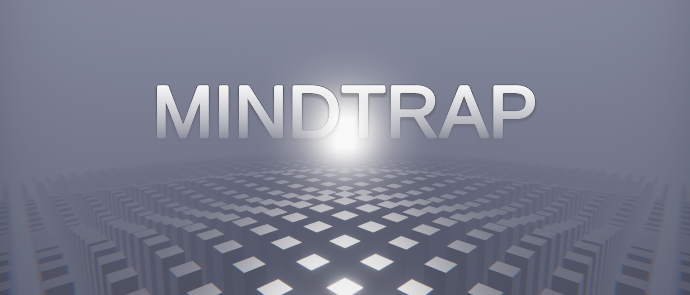

# MINDTRAP

<p align="center"></p>

## About

MINDTRAP is a **first-person puzzle platformer** where the main goal is to get through all the levels and wake up from a nightmare. The game uses **non-Euclidean geometry** and procedural content generation, such as **recursive backtracking algorithm** for labyrinth generation. Every gameplay is a **unique experience** in a way. There is an **auto save** implemented that is triggered after completion of each level. And also you can play with a mouse and keyboard as well as a **gamepad**.

You can **download for Windows** by clicking [here](https://m-biernat.itch.io/mindtrap).

## Tools & Dependencies

 - [Unity 2019.2.21](https://unity.com/releases/editor/whats-new/2019.2.21) - game engine;
 - [Blender 2.81](https://www.blender.org/download/releases/2-81/) - to create 3D models.

*The project requires Blender installed because of ```.blend``` files.*

## Credits

 - **Michał Biernat** @[m-biernat](https://github.com/m-biernat) - game designer, programmer;
 - **Anna Hosumbek** @[An-Hos](https://github.com/An-Hos) - 3D artist.

BGM and SFX are from [Freesound.org](https://freesound.org/), licensed under [CC0](https://creativecommons.org/publicdomain/zero/1.0/).

## License

All rights reserved ([no license](https://choosealicense.com/no-permission/)): 
 - You **can** view (peek into the code and assets) and fork this repository;
 - You **cannot** reproduce, distribute, or create derivative works;
 - You **can** play the game (*"MINDTRAP"*) free of charge via the provided channels.
